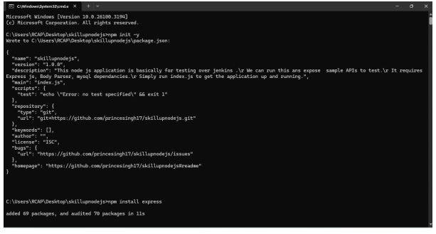
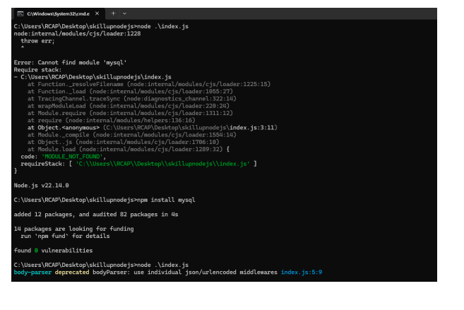
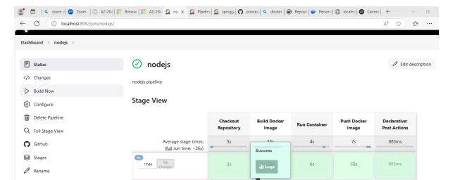
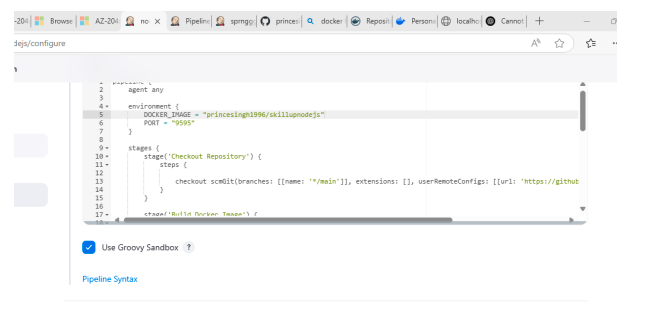
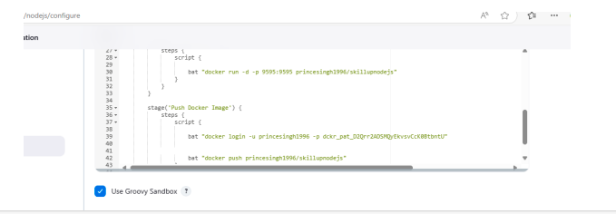
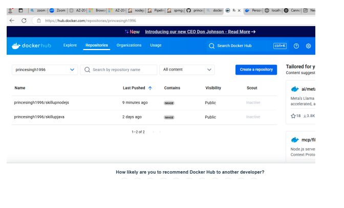
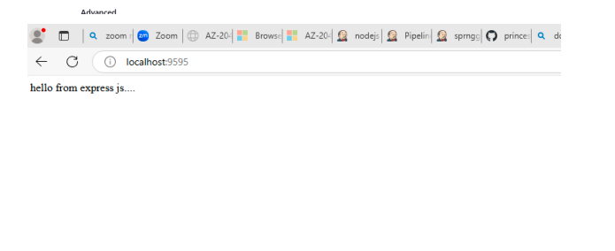

# SkillUp Node.js Web App – CI/CD with Jenkins 

## 🚀 Overview

This project showcases a **manual CI/CD pipeline setup** for a Node.js application using **Jenkins** and **GitHub**. The goal is to demonstrate automation of build and test steps using Jenkins while managing the application code in GitHub.

## 🧰 Tools & Technologies

- Node.js
- Git & GitHub
- Jenkins (Pipeline)
- NPM (Node Package Manager))

## 🔄 Pipeline Workflow

1. Code is updated and committed to GitHub.
2. **Manually trigger** Jenkins job from Jenkins dashboard.
3. Jenkins job performs:
   - Cloning the latest code from GitHub
   - Installing dependencies via `npm install`
   - Running unit tests with `npm test`
  

## 🛠 Jenkins Configuration

- **Job Type**: Declarative Pipeline
- **SCM**: GitHub repo 
- **Build Trigger**: Manual
## 📸 Screenshots

Included real screenshots from  Jenkins setup:
- Installed missing dependency
- 

- Jenkins dashboard
- 

- Job configuration
- 

- Buld and Pushed docker Image to Docker Hub
- 

- Console output of a successful run
- 

✅ Outcome
Node.js app is built and tested via Jenkins.

Manual pipeline provides flexibility to control execution.

Artifacts or deployment steps can be added later.

📚 What I Learned
How to automate npm install and npm test via Jenkins

Integrating GitHub with Jenkins (manual jobs)

Creating structured DevOps workflows for Node.js projects
